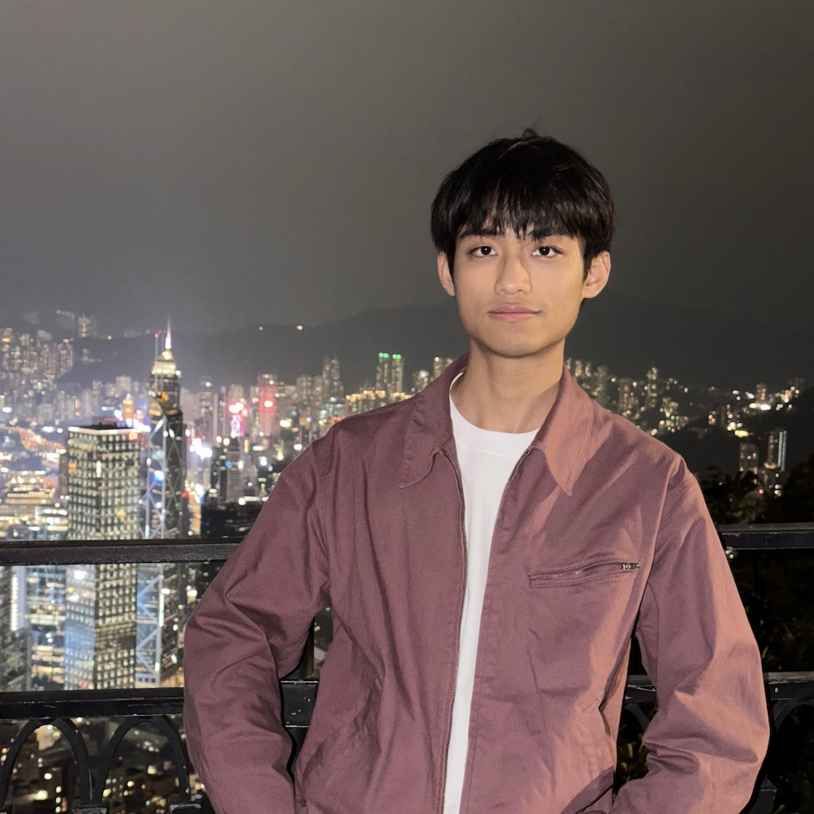

<section class="profile-container">
  

    
  

  

    <h1>Yuyang Wei (韦雨阳)</h1>
    
Hi! I am a third year PhD student at <a href="https://www.universiteitleiden.nl/en/humanities/leiden-university-centre-for-linguistics">Leiden University Centre for Linguistics</a>, advised by <a href="https://www.universiteitleiden.nl/en/staffmembers/rint-sybesma">Professor Rint Sybesma</a> and <a href="https://www.universiteitleiden.nl/en/staffmembers/zhaole-yang">Dr. Zhaole Yang</a>.

    
Email: {{ site.email }}

    
<a href="https://academictree.org/linguistics/tree.php?pid=948433#">My academic tree</a>

  

</section>

## Education

* PhD student in linguistics, Leiden University, now
* MA in Linguistics and Applied Linguistics, [Guangdong University of Foreign Studies](https://english.gdufs.edu.cn), 2023
* BA in English, [Nankai University](https://en.nankai.edu.cn), 2020

## Research interests

* generative grammar; syntax; Chinese linguistics
* the syntax of [inner aspect](https://doi.org/10.1163/2210-7363_ecll_COM_000294)
* sentence final particles
